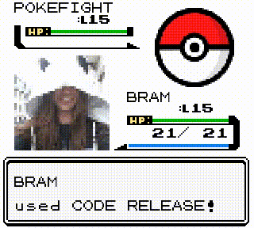

A stupid bot that generate images like the one above between 2 mastodon users.

# Installation

You need to have virtualenv installed, on debian/ubuntu:

    sudo apt-get install python-virtualenv

You also need dependencies to compile the python libs. On debian/ubuntu that looks like this:

    sudo apt-get install python-dev python-setuptools libtiff5-dev libjpeg-dev zlib1g-dev libfreetype6-dev liblcms2-dev libwebp-dev libharfbuzz-dev libfribidi-dev tcl8.6-dev tk8.6-dev python-tk

And ffmpeg to generate the mp4:

    sudo apt-get install ffmpeg

Then:

    git clone https://github.com/psycojoker/pokefight
    cd pokefight
    virtualenv ve
    ve/bin/pip install -r requirements.txt
